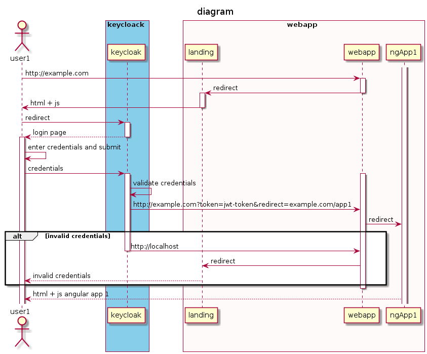

# App Sample serving ng apps w/ user verification via static webpage

Example to demostrate how to serve and angular application with authentication controlled by an external static page instead of integrate authentication in the angular app.

Same schema applies for several users in this case the description is for single user



But the practical example will use 2 ng apps and 2 users.

- Users belong to different realms, meaning user 1 can not access app2 and viceversa.

- Users are registered in a keycloak server 


## Keycloack server run

Prerequisites: Make sure you have docker installed as for simplicity we will be using the keycloack docker image _quay.io/keycloak/keycloak:15.0.2_

In a Shell execute 

```bash
$: ./startKeycloak.sh
```

this will create the container. Then visit http://localhost:8080 server will be running.

Admin credentials:

- username: *admin*
- password: *admin*

**References**: [Keycloack docker documentation](https://www.keycloak.org/getting-started/getting-started-docker)


## Client Authentication
