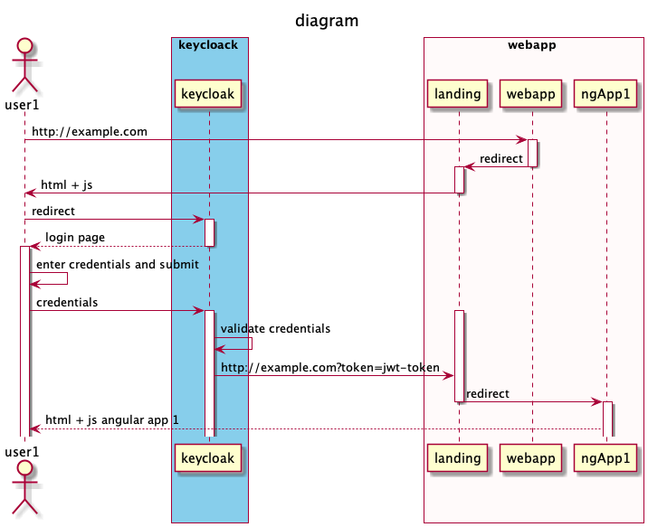
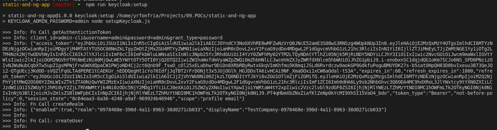
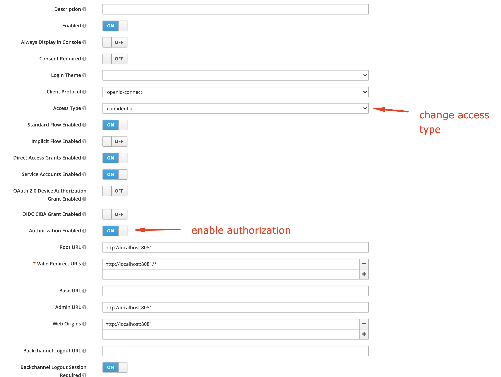

# App Sample serving ng apps w/ user verification via static webpage

Example to demostrate how to serve and angular application with authentication controlled by an external app instead of integrate authentication in the angular app.

Same schema applies for several users in this case the description is for single user




## Keycloack server run

Prerequisites: Make sure you have docker installed as for simplicity we will be using the keycloack docker image _quay.io/keycloak/keycloak:15.0.2_

In a Shell execute 

```bash
$: ./startKeycloak.sh
```

this will create the container. Then visit http://localhost:8080 server will be running.

Admin credentials:

- username: *admin*
- password: *admin*

Make sure you set *admin/admin* as credentials th username and password are wired in the package.json for the keycloak:setup npm script to configure the keycloak server (se below)
### Realm, User and client creation

To prepare the keycloack server for this POC we nee to do the following:

- create a realm
- create the users in the realm
- create the applications in the realm

To accomplish these tasks you should run a script provided in the source code

```bash
$ npm run keycloack:setup
```

The output for this command will show you the realm that has been created for running the examples. 



Notice the ouput show the realm that was created for you.

```json
{"enabled":true,"realm":"0978468e-390d-4a11-8963-38d0271cb033","displayName":"TestCompany-0978468e-390d-4a11-8963-38d0271cb033"}
```

Every time you run the script the realm will be created again with unique id.
It's also important to make you notice when you remove the container it will be deleted so all **information will be erased**.

If need to test the users you already created you can do thei following:

- visit: http://localhost:8080/auth/realms/**replace your realm name here**/account
- login using user credentials.
    
    - jonhdoe/ok123
    - janedoe/ok123

Your realm is in the output shown before, ej:

## Client Authentication frontend

After keycloak setup completed do the followind steps:

- login into keycloak admin console
- locate the realm created using the id displayed in the console
- go to the clients section
- locate client with name "theClient"
- go to the installation tab in client details and select JSON from the dropdown, then download the keycloak.json file
- copy the downloaded file in the "landing" directory on this app

Next step is run the webapp

```bash
$ npm run auth:frontend
```

Navigate with your browser to http://localhost:8081

You will be redirected automatically to keycloak login page. There you need to enter your credentials

- username: johndoe
- password: ok123

Now you will be redirected back to your landing page and you will see you are authenticated

What's next:

The token will appear in the `localStorage` under the key `kcToken`

To invalidate your credentials need to delete these cookies living under http://localhost:8080

- KEYCLOAK_IDENTITY_LEGACY
- KEYCLOAK_IDENTITY

### Pros

- Tokens are handled in the frontend.
- Redirects can be made in the frontend.

### Cons

- Keycloak library does not handle refresh token automatically.
- For refreshing the token each webapp must include the keycloak client library.
- Backend resources need to be protected by another mechanism, as this approach does not protect server resources.

## Client authentication Backend

To run the app using backend authentication run follow the steps in teh Keycloak server run section above 

Keycloak client setup for backend integration need to be tweaked using the console:

- access type: change from *public* to *confidential*
- enable authorization: *true*



Then use the install tab to create the keycloak.json file. Adjust the keycloak.js config file according the values in the keycloak.json and make sure about this:

- credentials must be in keycloak configuration
- bearerOnly: *false* in keycloack configuration if not there you should add it


Once you finish configuration should look like this.

```javascript
const config = {
    "realm": "7078c9ad-4d44-4c58-bda1-c1ec6cace22b",
    "auth-server-url": "http://localhost:8080/auth/",
    "ssl-required": "external",
    "resource": "theClient",
    "​bearerOnly": false,
    "credentials": {
        "secret": "86f92594-6242-4cd2-b976-69daf9968b85"
    },
    "confidential-port": 0,
    "policy-enforcer": {}
};
```

Next run the webserver

```bash
$ npm run auth:backend
```

This command will run the webserver with keycloak authentication triggered in the backend.

Browse `http://localhost:8081` you should be redirected inmediately to the login page. After you enter credentials

- user: johndoe
- password: ok123

You should be redirected to the angular app, token will appear in a cookie in the angular app.


### Pros:

- All authentication is handled by the Webapp (serverside).
- Server side resources (ng Apps) are protected out of the box using `keycloak.protect()`
- No need to a landing page and client redirections.

### Cons

- Token refreshing need to be done by the Webapp (this may be complex because ng apps will have to talk to webapp to refresh tokens when these ones expire)
- Webapp may be considered part of backend (not necesarily the bakend services the ng apps talk to perform business operations)
- Webapp may be behing proxy that already validate tokens


# Additional findings

Ng Apps `base` meta has to be modified to match the specific route in the `app.use` express calls, otherwise the additional resources needed by the angular app will not be loaded properly and the app will not work.

# Questions

If we use Envoy as a router to services:

- Can envoy proxy validate the access token for protecting backend services ?
- Will webapp run as another backend service, meaning behind envoy ?


# References

- [Keycloack docker documentation](https://www.keycloak.org/getting-started/getting-started-docker)
- [Keycloak javascript adapter documentation](https://www.keycloak.org/docs/latest/securing_apps/index.html#_javascript_adapter)
- [Keycloak nodejs adapter documentation](https://www.keycloak.org/docs/latest/securing_apps/index.html#_nodejs_adapter)